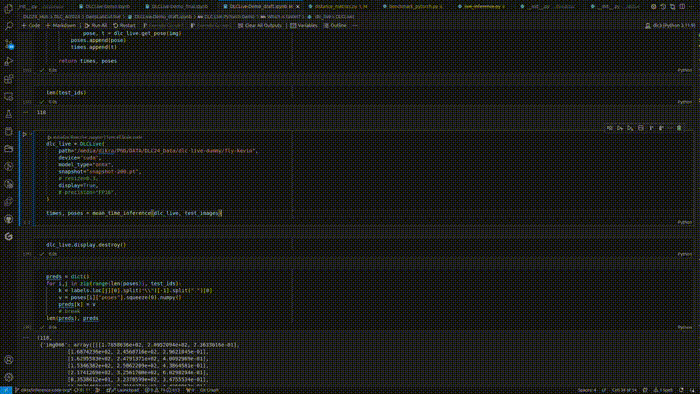

# DeepLabCut-Live: 3.0

## Quick Note - Current (dev) Installation with DeepLabCut-Live-GUI

DeepLabCut-live is currently being developed to run DeepLabCut 3.0 models. Here are 
instructions on how to get your models working.

**Installation** is still a bit tedious, but not impossible. Right now, you need to 
clone this repository to run DeepLabCut-live for DeepLabCut PyTorch models. The basic
recommended steps are as follows:

1. Create a `conda` environment for DeepLabCut-live 3.0
2. Install the [PyTorch version you need](https://pytorch.org/get-started/locally/) (we
require `torch>=2.0.0`, but make sure you install the correct version to take advantage
of your GPU if you have one). We need both `torch` and `torchvision`.
3. Install [`pytables`](https://www.pytables.org/usersguide/installation.html) (this is
very easy using `conda`, and can be more painful with `pip` - we recommend installing 
with conda).
4. Install a custom version of [DeepLabCut-Live-GUI](
https://github.com/DeepLabCut/DeepLabCut-live-GUI/tree/niels/update_for_dlc3)
5. Install the code 

```bash
### 1. Create your conda environment
conda create -n dlc3live python=3.10
conda activate dlc3live

### 2. Install PyTorch and Torchvision - this version is for CUDA 12.1 (and was tested 
# with CUDA 12.2 as well).
pip install torch torchvision --index-url https://download.pytorch.org/whl/cu121

### 3. Install PyTables
conda install -c conda-forge pytables==3.8.0

### 4. Install the custom DLCLive-GUI code
pip install "git+https://github.com/DeepLabCut/DeepLabCut-live-GUI.git@niels/update_for_dlc3"

### 5. Install DLCLive
# Clone this repo, checkout the correct branch
git clone https://github.com/DeepLabCutAIResidency/DLC_AI2024.git
git checkout niels/dlclive-dev
# Install from source
cd DLC_AI2024/DeepLabCut-live
pip install .

### Finally - launch the DLCLive GUI
dlclivegui
```

**Exporting models:** You can export your DeepLabCut 3.0 models using the 
`scripts/export.py` script. This will output a single file (e.g. 
`"dlclive-export-bu-resnet50.pt"`) which should be used with DLCLive.

## DeepLabCut-Live: 3.0

This repository contains a [DeepLabCut](http://www.mousemotorlab.org/deeplabcut) inference pipeline for real-time 
applications that has minimal (software) dependencies. This new DLC Live pipeline can 
handle DLC models produced in PyTorch, as of DLC 3.0.

In DLC Live TensorFlow, model export is handled in the main DLC package. 
The current pipeline handles both model export and video inference. The means that 
currently DLCLive still uses the main DLC package as well. The aim is for the model 
export to be a function of the main DLC package, allowing DLC Live to be a standalone
package with minimal software dependencies.

**Contents of this package:** This package provides a `DLCLive` class which enables pose
estimation online to provide feedback. This object loads and prepares a DeepLabCut
network for inference, and will return the predicted pose for single images. 

In the future this package should also contain a `Processor` object. We have not yet
had time to work on this object, and the code currently provides a placeholder object
for `Processor` that does not carry out any specific function.

For details on the `Processor` object in DLCLive TensorFlow, see documentation 
[here](dlclive/processor/README.md).

**🎥🎥🎥 Note :: alone, this object does not record video or capture images from a 
camera. This pipeline provides scripts to run video inference on a prerecorded video,
as well as video inference on a live video feed.🎥🎥🎥**


# Quick Start: instructions for use:

To use DLCLive 3.0, two methods for doing so are provided. Besides using the provided
scripts to open a camera feed (live or prerecorded), it is also possible to use the
DLCLive object directly. 
TODO: does the current version of DLCLive support this?
1. Initialize `Processor` (if desired) - the current version of this repo has not 
actively worked with different processors.
2. Initialize the `DLCLive` object
3. Perform pose estimation!

```python
from dlclive import DLCLive, Processor
dlc_proc = Processor()
dlc_live = DLCLive(<path to exported model directory>, processor=dlc_proc)
dlc_live.init_inference(<your image>)
dlc_live.get_pose(<your image>)
```

`DLCLive` **inputs:**
  - `<your image>` = is a numpy array of each frame
  - `<path to exported model directory>` = path to the folder that has the `.pt` and 
config file (for pytorch projects) or `.onnx` files. The .onnx file is acquired after
using the torch.onnx.export function (see demo notebook for examples of how to do so).
`.pt` and config files are provided in the folder of the DLC project.  

```
dlc-project
|
|___dlc-models-pytorch
|   |__ iterationX
|       |__ shuffleX
|           |__pytorch_config.yaml
|           |__snapshot-X.pt
|  

```
  
**TODO**: add docs instructions for model export using ONNX.


Both video inference on pre-recorded and live video feeds use the `DLCLive` as the
central component.

`DLCLive` **parameters:**
  - `path` = string; full path to the exported DLC model directory
  - `device` = str, default = cpu; whether the model should run on GPU (if available)
or CPU.
  - `model_type` = string; the type of model to use for inference. Default = onnx.
Types include:
      - `pytorch` = the base DeepLabCut model produced by DLC 3.0 using PyTorch as the
engine 
      - `onnx` = this assumes the user has exported their PyTorch model (using a .pt
snapshot and pytorch_config file) to an ONNX model [onnx](https://onnxruntime.ai/pytorch) and uses ONNX runtime
      - `tensorrt` = currently compatible with ONNX models but not PyTorch models, and
uses a TensorRT runtime ##DIKRA is this correctly specified?
  - `precision` = string, optional
        precision of model weights. Can be 'FP32' (default) or 'FP16'. Note: FP16 is
only available for ONNX.
  - `cropping` = list of int, optional; cropping parameters in pixel number:
`[x1, x2, y1, y2]`
  - `dynamic` = triple, containing (state, detectiontreshold, margin). If not wanting 
to use dynamic cropping, state should be set to False. Default: `(False, 0.5, 10)`. 
      - If the state is true, then dynamic cropping will be performed. That means that
if an object is detected (i.e. any body part > detectiontreshold), then object
boundaries are computed according to the smallest/largest x position and
smallest/largest y position of all body parts. This  window is expanded by the margin
and from then on only the posture within this crop is analyzed (until the object is
lost, i.e. <detectiontreshold). The current position is utilized for updating the crop
window for the next frame (this is why the margin is important and should be set large
enough given the movement of the animal).
  - `resize` = float, optional; factor by which to resize image (resize=0.5 downsizes 
both width and height of image by half). Can be used to downsize large images for faster
inference.
  - `processor` = dlc pose processor object, optional. The current code has not yet done
any active use of the processor parameter.
  - `display` = bool, optional; display processed image with DeepLabCut points. Can be
used to troubleshoot cropping and resizing parameters, but can be slow
  - `pcutoff` = float, default = 0.5; confidence cut-off for displaying key points.
  - `convert2rgb` = bool, optional; boolean flag to convert frames from BGR to RGB color 
scheme
  - `display_radius` = int, default = 3; radius of the points on the video display
  - `display_cmap`= str, default = "bmy"; color scheme of the key points on the display

## Video Analysis

### Option 1: Video inference on pre-recorded videos

TODO add __main__ element to script to use it in bash as well, not solely for importing
functions.

The benchmark_pytorch.py script provides the 'benchmark_videos' function for doing video
inference and benchmark inference speed on a pre-recorded video.

The function takes the same parameters as `DLCLive` as it directly calls the DLCLive
object. In addition, it takes the following arguments:

  - `video_path` = string; The path to the video file to be analyzed.
  - `save_poses` = bool, optional, default=False; Whether to save the detected poses to
CSV and HDF5 files.
  - `save_dir` = str, optional, default="model_predictions"; The directory where the
output video and pose data will be saved.
  - `draw_keypoint_names` = draw_keypoint_names : bool, optional, default=False; Whether
to draw the names of the keypoints on the video frames.
  - `cmap` = str, optional, default="bmy"; The colormap from the colorcet library to use
for keypoint visualization.
  - `get_sys_info` = bool, optional, default=True; Whether or not to obtain the
information of the system running the video inference. Will be printed, not saved.
**TODO:** save this information.

Example of how to run the function:

#### Python

```python
from dlclive.benchmark_pytorch import benchmark_videos

benchmark_videos(
    model_path='/path/to/exported/model',
    video_path='/path/to/video',
    save_dir='/path/to/output',
    resize=0.5,
)
```


### Option 2: Inference on live video feed


TODO add __main__ element to script to use it in bash as well, not solely for importing
functions.

The LiveVideoInference.py script provides the 'analyze_live_video' function for doing
live video tracking.

The function is similar in function to 'benchmark_videos' but replaces `video_path` with
the following arguments:

  - `camera` = float, default = 0; The camera to record the live video from. The default
'0' is the webcam if using a laptop. If using a USB webcam, this will typically obtain
the number of one of the USB ports, e.g. 1. If using a camera such a Basler, this will
likely need configuration. We have not tested this.
  - `experiment_name` = str, default = "Test"; Prefix to label generated pose and video
files.

Example of how to run the function:

#### Python

```python
from dlclive.LiveVideoInference import analyze_live_video

analyze_live_video(
    model_path='/path/to/exported/model',
    camera=0,
    experiment_name = "experiment_20240827",
    save_dir='/path/to/output',
    resize=0.5,
)
```


## Demo Notebook

This repository contains a notebook for demonstrating the functionalities of the
DLCLive 3.0. This can be found in [DLCLive-Demo.ipynb](https://github.com/DeepLabCutAIResidency/DLC_AI2024/blob/main/DeepLabCut-live/DLCLive-Demo.ipynb)

The `DLCLive-Demo_final.ipynb` notebook provides a comprehensive guide to using DLCLive
for offline as well as real-time pose estimation. This notebook is structured to help
you understand how to apply DLCLive to different use cases, including single-frame
inference, pre-recorded video inference, and live video inference.

### Sections of the Notebook

#### 1. Model Setup

This section demonstrates how to set up your model export. The aim is to export an ONNX
model that can be used in DLCLive 3.0, so the package will not be dependent on base DLC.
Currently this section is dependent on functionalities from DLC. In the future, these
components should be made part of base DLC perform model export to ONNX format.

To remove the dependcy on base DLC for the subsequent sections, the code in dlclive.py
for loading a pytorch model (compared to an ONNX model) would need to be removed as
well, but for the time being remains a part of DLCLive 3.0.

- **Key Steps:**
  1. Load the necessary libraries.
  2. Download test suite.
  3. Set up the working directory.
  4. Choose a project from the options in the test suite.
  5. Specifying a model by choosing the desired snapshot.
  6. Export the model to ONNX format.
  7. Generating an FP16 precision version of the exported model.

#### 2. Single Frame Inference

This section demonstrates how to perform pose estimation on a single image using a
pre-trained DeepLabCut model.

- **Key Steps:**
  1. Load an image for testing.
  2. Choose model type and device to run inference on.
  3. Obtain model size.
  4. Specify any resizing and cropping to be applied to inference, and whether to
display the tracking as it occurs.
  5. Specify the DLC live object to use for frame inference and perform inference to
detect keypoints.

#### 3. Pre-recorded Video Inference

This section covers running pose estimation on a pre-recorded video file, and optionally
saving the output with overlaid keypoints. This is intended for benchmarking purposes,
and thus the section includes code for obtaining characteristics of the video to be
benchmarked, an information on speed of inference. 

The code in `benchmark_pytorch.py` currently supports video inference on a single video.
We have not tested running benchmarking on more than one video at a time.

- **Key Steps:**
  1. Set up video capture from a file.
  2. Obtain characteristics of the video for benchmarking (fps, number of frames, 
videolength, size)
  3. Specify whether to save a labelled video.
  4. Analyze video.
  5. Run benchmarking analysis

#### 4. Live Video Inference

This section guides you through the process of performing real-time pose estimation
using a live video feed, such as from a webcam. 

- **Key Steps:**
  1. Using the current steps already initialized throughout the pipeline, the only
thing to be changed is adding the camera to use (default is 0 for using the built-in
webcam of a computer)
  2. If you would prefer to use a different project or model, or change other elements,
please go back to previous steps of the pipeline and make the necessary adjustments.


## Model Architectures and Test Suite
**Model Architectures Supported:** The pipeline has been developed using ResNet50 models
(ventral-gait, hand-track, and fly-kevin datasets) and top-down ResNet50 with SSD lite
detector (superbird_ssdlite). An hr_net is also available in the test data suite
(superbird), but has not been tested yet. See details in test suite contents section.

**Datasets in test suite:** The linked testing suite contains the following datasets,
provided by DLC core development team, and Allodi Lab, University of St Andrews.

`Test suite` **contents:**

  - `ventral-gait` 🐭 model trained for analyzing mouse gait from ventral perspective
on a treadmill in a model of ALS. Model is trained to detect 11 key points, used for
quantifying gait parameters including speed, cadence, stride length, and acceleration.
Folder contains single example image, snapshot.pt file and pytorch_config.yaml files
from the PyTorch trained model, and example video(s). If considering using this model, 
please cite [this article](https://www.nature.com/articles/s41467-024-48925-7)
   - `fly-kevin` 🪰 Model trained on drosophila. Further specification of the model to
be obtained from the creator. Folder contains example images for single image inference,
snapshot.pt file and pytorch_config.yaml files from the PyTorch trained model.
   - `hand-track` 👋🏼 Dummy model trained on small dataset from single video of a hand
wave recorded by Anna Stuckert. Inteded for testing live video inference. It is not a
highly accurate model, but useful for live inference testing purposes. Folder contains
snapshot.pt file and pytorch_config.yaml files from the PyTorch trained model. Note that
this folder does not contain example images or videos, so using it inside the demo
notebook you will have to go through the model loading and specification steps but
without running single frame or offline video inference on it, but solely using it for
live inference testing. TODO consider adding example video and frames in this. 
  - `superbird_ssdlite` 🦅 superbird foundation model trained using the DLC's 
SuperAnimal feature, using data from a large number of labelled datasets on birds to
create a foundation model for bird tracking. The trained model uses a top_down ResNet50
with SSDLite detector as the model architecture. The model is still under
troubleshooting when Shaokai had to leave, as there was quite some jittering in the
predictions of the keypoints. It seems the issue may be related to video_adaption not
working, which at the timepoint appeared to be an issue that is already under
investigation by Niels and is ongoing at the moment. Model in its current state is
included in the testing suite, but may need further fine-tuning before it is the final
model. The folder contains snapshot.pt (for keypoints) and snapshot-detector.pt (for
top-down bounding box detection) files and pytorch_config.yaml files from the PyTorch
trained model, and example video(s). When running with the model only, the snapshot.pt
file is used, which automatically implements the detector.
  - `superbird` 🐦‍⬛ likewise to superbird_ssdlite, but using the hr_netw32 architecture,
provided by shaokai. Folder contains the exported ONNX file from the testing phase. We
received the .pth file from Shaokai, but do not have the .pt file, so we have tried
converting the file to ONNX, but have not had success so far. 
  - `MiceofJun18` 🐭 This folder exists in 3 versions, one containing the snapshots and
pytorch_config.yaml files for a dekr_w32 model, a top_down_resnet_50, and a
top_down_hrnet_w32. We have not tested these models yet, but they are there for
reference for extending the model support.

**Benchmarking dataset and model:** Estimates of performance is carried out using a
PyTorch ResNet50 model and an associated video recording. Benchmarking has not been
carried out on other model architectures yet.

**Performance:** Benchmarking results are available below.

#### Dikra

| System | Model type | Runtime  | Device type | Precision                              | Video        | Video length (s) - # Frames | FPS | Frame size | Pose model backbone | Avg Inference time ± Std <br>*(including 1st inference)* | Avg Inference time ± Std | Average FPS ± Std | Model size |
| ------ | ---------- | -------- | ----------- | -------------------------------------- | ------------ | --------------------------- | --- | ---------- | ------------------- | -------------------------------------------------------- | ------------------------ | ----------------- | ---------- |
| Linux  | ONNX       | ONNX     | CUDA        | Full precision (FP32)                  | Ventral gait | 10s - 1.5k                  | 150 | (658,302)  | `ResNet50` (bu)     | 29.02ms ± 47.59ms                                        | 27.8ms ± 2.32ms          | 36 ± 3            | 92.12 MB   |
| Linux  | ONNX       | ONNX     | CPU         | Full precision (FP32)                  | Ventral gait | 10s - 1.5k                  | 150 | (658,302)  | `ResNet50` (bu)     | 146.12ms ± 13.26ms                                       | 146.11 ± 13.25           | 7 ± 1             | 92.12 MB   |
| Linux  | PyTorch    | PyTorch  | CUDA        | Full precision (FP32)                  | Ventral gait | 10s - 1.5k                  | 150 | (658,302)  | `ResNet50` (bu)     | 6.04ms ± 7.37ms                                          | 5.97ms ± 6.8ms           | 271 ± 112         | 96.5 MB    |
| Linux  | PyTorch    | PyTorch  | CPU         | Full precision (FP32)                  | Ventral gait | 10s - 1.5k                  | 150 | (658,302)  | `ResNet50` (bu)     | 365.26ms ± 13.88ms                                       | 365.17ms ± 13.44ms       | 3 ± 0             | 96.5 MB    |
| Linux  | ONNX       | TensorRT | CUDA        | Full precision (FP32) - no caching     | Ventral gait | 10s - 1.5k                  | 150 | (658,302)  | `ResNet50` (bu)     | 55.32ms ± 1254.16ms^                                     | 22.93ms ± 0.88           | 44 ± 2            | 92.12 MB   |
| Linux  | ONNX       | TensorRT | CUDA        | Full precision (FP32) - engine caching | Ventral gait | 10s - 1.5k                  | 150 | (658,302)  | `ResNet50` (bu)     | 20.8ms ± 3.4ms                                           | 20.72ms ± 1.25ms         | 48 ± 3            | 92.12 MB   |
| Linux  | ONNX       | TensorRT | CUDA        | FP16                                   | Ventral gait | 10s - 1.5k                  | 150 | (658,302)  | `ResNet50` (bu)     | 34.37ms ± 858.96ms                                       | 12.19ms ± 0.87           | 82 ± 6            | 46.16 MB   |
| Linux  | ONNX       | ONNX     | CUDA        | FP16                                   | Ventral gait | 10s - 1.5k                  | 150 | (658,302)  | `ResNet50` (bu)     | 21.74ms ± 43.24ms                                        | 20.62ms ± 2.5ms          | 49 ± 5            | 46.16 MB   |


#### Anna

| System | Model type | Runtime | Device type | Precision             | Video        | Video length (s) - # Frames | FPS | Display settings                                                | Frame size | Pose model backbone | Avg Inference time ± Std <br>*(including 1st inference)* | Avg Inference time ± Std | Average FPS ± Std                      | Model size |     |
| ------ | ---------- | ------- | ----------- | --------------------- | ------------ | --------------------------- | --- | --------------------------------------------------------------- | ---------- | ------------------- | -------------------------------------------------------- | ------------------------ | -------------------------------------- | ---------- | --- |
| Linux  | PyTorch    | PyTorch | CUDA2       | Full precision (FP32) | Ventral gait | 10s - 1.5k                  | 150 | resize= ;static_cropping= ;dynamic_cropping=False               | (658,302)  | `ResNet50` (bu)     | 8.4 ms ± 2.37                                            | 8.4 ms ± 2.37            | 127.80295706942844 ±32.126096479990736 |            |     |
| Linux  | PyTorch    | PyTorch | CUDA2       | Full precision (FP32) | Ventral gait | 10s - 1.5k                  | 150 | resize= 0.75 ;static_cropping= ;dynamic_cropping=False          | (658,302)  | `ResNet50` (bu)     | 7.58 ms ± 2.24                                           | 7.57 ms ± 2.19           | 140.69574946476615±31.1672937951312    |            |     |
| Linux  | PyTorch    | PyTorch | CUDA2       | Full precision (FP32) | Ventral gait | 10s - 1.5k                  | 150 | resize= 0.5 ;static_cropping= ;dynamic_cropping=False           | (658,302)  | `ResNet50` (bu)     | 8.0 ms ± 2.69                                            | 7.96 ms ± 2.35           | 134.2569262052867±31.488512533198566   |            |     |
| Linux  | PyTorch    | PyTorch | CUDA2       | Full precision (FP32) | Ventral gait | 10s - 1.5k                  | 150 | resize= 0.25 ;static_cropping= ;dynamic_cropping=False          | (658,302)  | `ResNet50` (bu)     | 8.15 ms ± 3.2                                            | 8.12 ms ± 2.95           | 135.0480895853283±35.06038218638934    |            |     |
| Linux  | PyTorch    | PyTorch | CUDA2       | Full precision (FP32) | Ventral gait | 10s - 1.5k                  | 150 | resize= 0.75 ;static_cropping= ;dynamic_cropping=(True,0.5,10,) | (658,302)  | `ResNet50` (bu)     | 8.08 ms ± 4.22                                           | 8.07 ms ± 4.22           | 137.33837035368126±35.6774640916414    |            |     |
| Linux  | PyTorch    | PyTorch | CUDA2       | Full precision (FP32) | Ventral gait | 10s - 1.5k                  | 150 | resize= 0.5 ;static_cropping= ;dynamic_cropping=(True,0.5,10,)  | (658,302)  | `ResNet50` (bu)     | 8.0 ms ± 3.29                                            | 8.0 ms ± 3.29            | 138.6379420526604±36.49288244838719    |            |     |
| Linux  | PyTorch    | PyTorch | CUDA2       | Full precision (FP32) | Ventral gait | 10s - 1.5k                  | 150 | resize= 0.25 ;static_cropping= ;dynamic_cropping=(True,0.5,10,) | (658,302)  | `ResNet50` (bu)     | 7.77 ms ± 3.24                                           | 7.77 ms ± 3.24           | 143.32119822665928±38.02649359116085   |            |     |
| Linux  | PyTorch    | PyTorch | CUDA2       | Full precision (FP32) | Ventral gait | 10s - 1.5k                  | 150 | resize= ;static_cropping= ;dynamic_cropping=(True,0.5,10,)      | (658,302)  | `ResNet50` (bu)     | 7.76 ms ± 3.83                                           | 7.75 ms ± 3.83           | 145.56150703456655±41.20078225328502   |            |     |
| Linux  | ONNX       | ONNX    | CUDA2       | Full precision (FP32) | Ventral gait | 10s - 1.5k                  | 150 | resize= ;static_cropping= ;dynamic_cropping=False               | (658,302)  | `ResNet50` (bu)     | 116.26 ms ± 22.33                                        | 116.19 ms ± 22.18        | 8.878997723404723±1.5224299265181573   | 91.95 MB   |     |
| Linux  | ONNX       | ONNX    | CUDA2       | Full precision (FP32) | Ventral gait | 10s - 1.5k                  | 150 | resize= 0.75 ;static_cropping= ;dynamic_cropping=False          | (658,302)  | `ResNet50` (bu)     | 61.79 ms ± 9.59                                          | 61.78 ms ± 9.58          | 16.624193291863726± 2.831181535141544  | 91.95 MB   |     |
| Linux  | ONNX       | ONNX    | CUDA2       | Full precision (FP32) | Ventral gait | 10s - 1.5k                  | 150 | resize= 0.5 ;static_cropping= ;dynamic_cropping=False           | (658,302)  | `ResNet50` (bu)     | 25.72 ms ± 3.04                                          | 25.71 ms ± 3.02          | 39.308008511460336±3.6611670577178566  | 91.95 MB   |     |
| Linux  | ONNX       | ONNX    | CUDA2       | Full precision (FP32) | Ventral gait | 10s - 1.5k                  | 150 | resize= 0.25 ;static_cropping= ;dynamic_cropping=False          | (658,302)  | `ResNet50` (bu)     | 11.26 ms ± 0.83                                          | 11.26 ms ± 0.82          | 89.18368876503979± 5.484307414366839   | 91.95 MB   |     |
| Linux  | ONNX       | ONNX    | CUDA2       | Full precision (FP32) | Ventral gait | 10s - 1.5k                  | 150 | resize= 0.75 ;static_cropping= ;dynamic_cropping=(True,0.5,10,) | (658,302)  | `ResNet50` (bu)     | 62.0 ms ± 9.63                                           | 61.99 ms ± 9.63          | 16.56595566435532± 2.810436948245625   | 91.95 MB   |     |
| Linux  | ONNX       | ONNX    | CUDA2       | Full precision (FP32) | Ventral gait | 10s - 1.5k                  | 150 | resize= 0.5 ;static_cropping= ;dynamic_cropping=(True,0.5,10,)  | (658,302)  | `ResNet50` (bu)     | 29.58 ms ± 4.57                                          | 29.58 ms ± 4.56          | 34.64846010089202± 5.479857334202221   | 91.95 MB   |     |
| Linux  | ONNX       | ONNX    | CUDA2       | Full precision (FP32) | Ventral gait | 10s - 1.5k                  | 150 | resize= 0.25 ;static_cropping= ;dynamic_cropping=(True,0.5,10,) | (658,302)  | `ResNet50` (bu)     | 11.01 ms ± 0.29                                          | 11.01 ms ± 0.22          | 90.83395368901749±1.806608338067154    | 91.95 MB   |     |
| Linux  | PyTorch    | PyTorch | CUDA2       | FP16                  | Ventral gait | 10s - 1.5k                  | 150 | resize= ;static_cropping= ;dynamic_cropping=(True,0.5,10,)      | (658,302)  | `ResNet50` (bu)     | 4.93 ms ± 0.77                                           | 4.93 ms ± 0.77           | 205.15884637642938±16.38324984833676   |            |     |
| Linux  | PyTorch    | PyTorch | CUDA2       | FP16                  | Ventral gait | 10s - 1.5k                  | 150 | resize= 0.75 ;static_cropping= ;dynamic_cropping=False          | (658,302)  | `ResNet50` (bu)     | 4.83 ms ± 0.62                                           | 4.83 ms ± 0.62           | 208.67090717003128±14.432496770285296  |            |     |
| Linux  | PyTorch    | PyTorch | CUDA2       | FP16                  | Ventral gait | 10s - 1.5k                  | 150 | resize= 0.5 ;static_cropping= ;dynamic_cropping=False           | (658,302)  | `ResNet50` (bu)     | 4.85 ms ± 0.47                                           | 4.85 ms ± 0.47           | 207.3224992867458±12.335273341700686   |            |     |
| Linux  | PyTorch    | PyTorch | CUDA2       | FP16                  | Ventral gait | 10s - 1.5k                  | 150 | resize= 0.25 ;static_cropping= ;dynamic_cropping=False          | (658,302)  | `ResNet50` (bu)     | 4.85 ms ± 0.42                                           | 4.85 ms ± 0.42           | 207.2406953317086±11.094254913165969   |            |     |
| Linux  | PyTorch    | PyTorch | CUDA2       | FP16                  | Ventral gait | 10s - 1.5k                  | 150 | resize= 0.75 ;static_cropping= ;dynamic_cropping=(True,0.5,10,) | (658,302)  | `ResNet50` (bu)     | 4.94 ms ± 0.56                                           | 4.93 ms ± 0.56           | 203.99000274993014±12.844352706163914  |            |     |
| Linux  | PyTorch    | PyTorch | CUDA2       | FP16                  | Ventral gait | 10s - 1.5k                  | 150 | resize= 0.5 ;static_cropping= ;dynamic_cropping=(True,0.5,10,)  | (658,302)  | `ResNet50` (bu)     | 4.84 ms ± 0.73                                           | 4.84 ms ± 0.73           | 208.96948280451284±16.759037617799635  |            |     |
| Linux  | PyTorch    | PyTorch | CUDA2       | FP16                  | Ventral gait | 10s - 1.5k                  | 150 | resize= 0.25 ;static_cropping= ;dynamic_cropping=(True,0.5,10,) | (658,302)  | `ResNet50` (bu)     | 4.8 ms ± 0.65                                            | 4.8 ms ± 0.65            | 210.25889036876802±15.576547079641776  |            |     |


CUDA2 = Linux-5.14.0-1050-oem-x86_64-with-glibc2.35, NVIDIA TITAN RTX

# Future work

**Metrics for benchmarking:** We are have been working on implementing the metrics from
dlc3 to run on the inferences from DLCLive 3.0. It seems as if the code is working,
however the metrics are looking very poor (examples of RMSE ~220 and mAP < 1, despite
the tracking looking good)
Thus there must be something off, which we have not been able to figure out on our own
yet. The code is available in the branch metrics_dev.



Moreover, only the fly-kevin dataset has a .json file where we can tell which of the
labelled frames belong to test and train data, in order to not run the metrics on data
belonging to the test set. Thus the code is currently applicable to the fly-kevin 
dataset. 

**Command line usage:** We have tried to adapt the code be used both in the notebook and
using command line. The benchmarking does work in command line, however the adaptations
needed to run it in commandline prevented it to be used in the notebook. We have kept
code to use benchmark_pytorch.py in command line the command_line_dev branch to not
confound the notebook at the current time.

**Processor:** The processor element of DLCLive is not yet implemented in the DLCLive
3.0 code.

**Files not currently in use / have not edited these since cloning the repo:** 

dlclive folder:
- pose.py
- benchmark.py
- Exceptions.py
- Version.py
- graph.py

main folder:
- poetry.lock
- pyproject.toml
- reinstall.sh

docs folder:
- install_desktop.md
- install_jetson.md

benchmarking folder
check install folder
example processors folder

Files to remove:
- LiveVideoAnalysis.ipynb
- DLCLive-Demo_draft.ipynb
- DLCLive-Demo.ipynb
