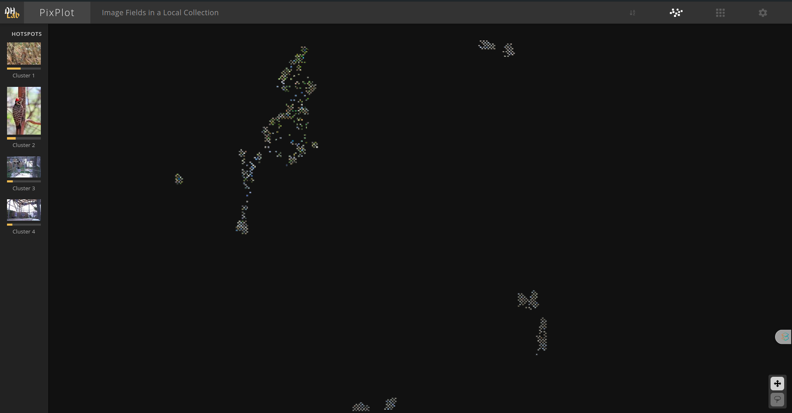

For a better understanding of the predicted clusters in the [Data Analysis Notebook](data_analysis.ipynb), you can use this Dash app that allows to interactively visualise the raw images corresponding to all the points in the clusters. 


To run the Dash app, start by replacing the data files paths in the [cluster_viz_dash.py](cluster_viz_dash.py) file, then, run:
```bash
python cluster_viz_dash.py
```

Another way to look at the image similarities, is by clustering them based on their visual aspect using CNNs then a clustering algorithm.
The PixPlot framework does this using Inception CNN, and uses UMAP algorithm for dimensionality reduction, then, a KMeans algorithm to cluster similar images together

